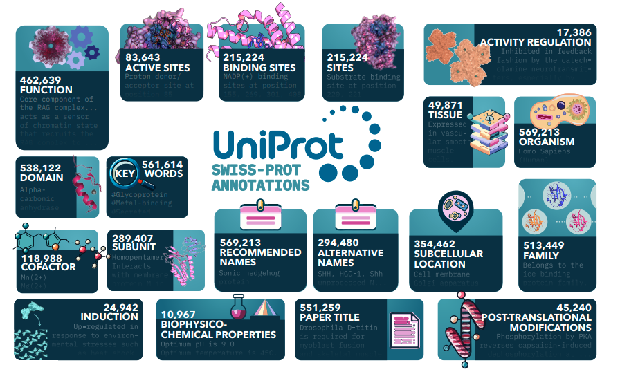

# PAIR: Protein Annotation-Improved Representations

[](https://www.biorxiv.org/content/10.1101/2024.07.22.604688v2.abstract)


This repository contains the implementation of "Boosting the Predictive Power of Protein Representations with a Corpus of Text Annotations" (2024).




## Highlights

- Fine-tuning framework for protein language models
- Utilizes 19 types of text annotations from UniProt
- Transformer-based encoder-decoder architecture
- Improved performance over BLAST baseline
- Pre-computed vector representations for efficient retrieval

## File structures

### `_config/`
- `fact_types.yml`: Hyperparameters for parsing and loading each fact type
- `paths.yml`: Paths for datasets

### `_evaluation/`
- `get_embeddings.py`: Generate embeddings for each model
- `knn_embeddings.py`: Perform knn on the precomputing embedding

### `_fact/`
- `_/parse.py`: parser code for each fact type
- `_/batch.py`: Batch operation for each fact type

### `_model/`
- `_/model.py`: implementations of the seq2seq architecture
- `_/config.py`: Hyperparameters of the model
- `dataloader_ddp.py`: General implementations of the data loader

## Installation

pip install -r requirements.txt

## Running the code

### Data preparation

1. Download the xml.gz from UniProt and change the paths in `_config/paths.yml`.
2. Change the parse flag in `_config/fact_types.yml` to True
3. Run `python parse.py`

### Training

1. Change the hyperparameters in `_model/config.py`.
2. Adjust the compute configuration in `submit_worker_reference.sh` according to your cluster.
3. Submit the job `sbatch submit.sh` in slurm.

### Evaluation
1. `cd _evaluation`
2. Change `modelname`, `trainset`, `valset` in `submit.sh`
3. Submit the job `sbatch submit.sh` in slurm.

## Contact

- Email: haonand@cs.toronto.edu, martaskreta@cs.toronto.edu


## Citation

If you use this work in your research, please cite:

### Paper
```bibtex
@article{duan2024boosting,
   title={Boosting the Predictive Power of Protein Representations with a Corpus of Text Annotations},
   author={Duan, Haonan and Skreta, Marta and Cotta, Leonardo and Rajaonson, Ella Miray and Dhawan, Nikita and Aspuru-Guzik, Al{\'a}n and Maddison, Chris J.},
   journal={bioRxiv},
   year={2024},
   doi={10.1101/2024.07.22.604688}
}


